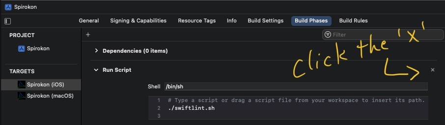

# Spirokonia

A toy, a virtual "spirograph", inspired by YouTuber Sort of School's #SoME1
[video](https://youtu.be/n-e9C8g5x68), which was inspired by YouTuber 3Blue1Brown's #SoME1
[challenge](https://youtu.be/ojjzXyQCzso)

# Dependencies

* Packages

  These are already built into the project; you don't have to do anything special, except wait a
  minute after you load the workspace, for Xcode to find the packages online. If you get an error
  about Easing not being available, you probably just haven't waited long enough.

  * [Easing](https://github.com/manuelCarlos/Easing)
  * [swift-numerics](https://github.com/apple/swift-numerics)

* Other

  * [SwiftLint](https://github.com/realm/SwiftLint) - you can disable this dependency by removing
  it from the Build Phases for your target.
  
  &nbsp;
  
  
  Or you can install it. See the instructions on their
  [github page](https://github.com/realm/SwiftLint). It's an incredibly useful tool.

# Installation

* Clone.
* Checkout the `spirozen` branch.
* Build one of the SpiroZen targets. The other targets are for developing new components.
