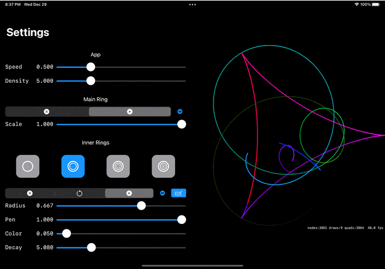

# Spirokonia

A toy, a virtual "spirograph", inspired by YouTuber Sort of School's #SoME1 [video](https://youtu.be/n-e9C8g5x68), which was inspired by YouTuber 3Blue1Brown's #SoME1 [challenge](https://youtu.be/ojjzXyQCzso)

# Installation

* Clone
* Build one of the Spirokonia targets. The other targets are for developing new components.
* Prefer the iPad target in landscape orientation or the macOS target. It does run on iPhone, but I haven't yet figured out a user-friendly way to present the views.

# How to use the controls -- coming soon

